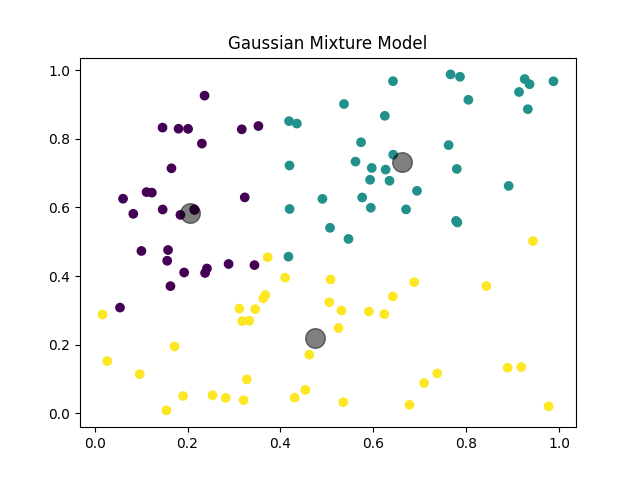
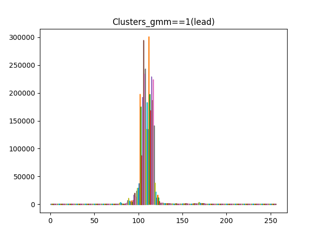
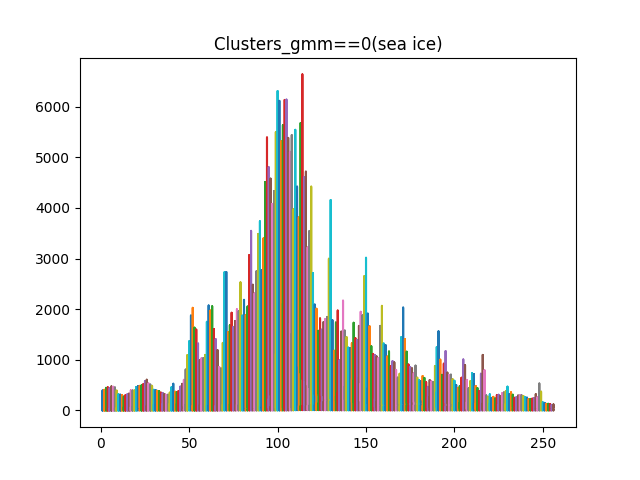

# Assignment-Week-4
<!-- Back to top link -->
<a name="readme-top"></a>
<br />
<div align="center">
  <a href="https://github.com/Gabriel060424/Assignment-Week-4">
    
  </a>
 <h3 align="center">GEOL0069 Week 4: Unsupervised Sea Ice vs. Lead Classification</h3>
<p align="justify">
    This project applies unsupervised learning techniques to distinguish between sea ice and leads (open water channels) using Sentinel-3 altimetry data. The analysis builds upon the foundational notebook Unit_2_Unsupervised_Learning_Methods_updated.ipynb, implementing Gaussian Mixture Models (GMM) to classify radar echoes based on their waveform characteristics. The results are validated against official ESA classifications using a confusion matrix, providing a quantitative assessment of the model's performance in real-world Earth Observation scenarios.
  </p>
<!-- Badges -->
  <p>
    
  </p>
</div>
<!-- TABLE OF CONTENTS -->
<details>
  <summary><strong>Table of Contents</strong></summary>
  <ol>
    <li><a href="#introduction-to-unsupervised-learning">Introduction to Unsupervised Learn
ing</a>
      <ul>
        <li><a href="#k-means-clustering">K-means Clustering</a></li>
        <li><a href="#gaussian-mixture-models-gmm">Gaussian Mixture Models (GMM)</a></li>
      </ul>
    </li>
    <li><a href="#methods--implementation">Methods & Implementation</a>
      <ul>
        <li><a href="#prerequisites--installation">Prerequisites & Installation</a></li>
        <li><a href="#context-sentinel-3-mission">Context: Sentinel-3 Mission</a></li>
      </ul>
    </li>
    <li><a href="#results">Results</a>
      <ul>
        <li><a href="#1-gaussian-mixture-model-demonstration">1. Gaussian Mixture Model Demonstration</a></li>
        <li><a href="#2-mean-and-standard-deviation-analysis">2. Mean and Standard Deviation Analysis</a></li>
        <li><a href="#3-lead-cluster-waveforms">3. Lead Cluster Waveforms</a></li>
        <li><a href="#4-sea-ice-cluster-waveforms">4. Sea Ice Cluster Waveforms</a></li>
        <li><a href="#5-echo-alignment-examples">5. Echo Alignment Examples</a></li>
        <li><a href="#6-validation-confusion-matrix">6. Validation: Confusion Matrix</a></li>
      </ul>
    </li>
    <li><a href="#contact">Contact</a></li>
    <li><a href="#acknowledgments">Acknowledgments</a></li>
  </ol>
</details>
<!-- INTRODUCTION TO UNSUPERVISED LEARNING -->

# Introduction to unsupervised learning

Unsupervised learning methods are essential for discovering hidden patterns in unlabeled data, making them particularly valuable for Earth Observation applications where ground truth data may be limited. This project focuses on two fundamental approaches: K-means clustering and Gaussian Mixture Models.
## K-means Clustering

K-means clustering is a centroid-based algorithm that partitions data into k groups by minimizing the within-cluster variance. The algorithm iteratively assigns data points to the nearest centroid and updates centroid positions until convergence. Key characteristics include:

- **Choosing K**: The number of clusters must be specified in advance
- **Centroid Initialization**: Initial placement affects final results
- **Assignment Step**: Points assigned based on squared Euclidean distance
- **Update Step**: Centroids recomputed as cluster means

**Advantages**: Computational efficiency and ease of interpretation make K-means ideal for exploratory data analysis with large datasets.
## Gaussian Mixture Models (GMM)

Gaussian Mixture Models offer a probabilistic framework for clustering by representing data as a combination of multiple Gaussian distributions. Each component in the mixture is characterized by its own mean vector and covariance structure, allowing the model to capture complex data patterns that simpler methods might miss.

**Core Components**:
- **Mixture Components**: The number of Gaussian distributions in the model, analogous to the number of clusters in other approaches
- **Expectation-Maximization (EM)**: An iterative optimization algorithm that alternates between estimating membership probabilities and updating distribution parameters
- **Covariance Structure**: Defines the geometric properties of each cluster—spherical, diagonal, or full covariance matrices accommodate different cluster shapes

**Why GMM for This Application?**
- **Soft Assignments**: Rather than forcing each echo into a single category, GMM provides probabilities of belonging to each class, capturing classification uncertainty inherent in mixed or transitional surface types
- **Adaptive Geometry**: The flexible covariance structure can accommodate the different shapes of sea ice and lead distributions in feature space
- **Density Estimation**: The model captures not just cluster centers but the full probability distribution of each class, valuable for understanding natural variability

The EM algorithm powers GMM fitting through two repeating steps: the Expectation step calculates the likelihood of each data point belonging to each component, while the Maximization step updates the Gaussian parameters to maximize these likelihoods. This continues until convergence, yielding both cluster assignments and uncertainty estimates for every observation.

<p align="right">(<a href="#readme-top">back to top</a>)</p>
<!-- METHODS & IMPLEMENTATION -->

# Methods & Implementation

## Prerequisites & Installation

The following software needs to be installed to run the code:

```sh
# Install required packages
!pip install netCDF4
!pip install basemap
!pip install cartopy
!pip install scikit-learn matplotlib numpy rasterio

# Mount Google Drive for data access (in Colab)
from google.colab import drive
drive.mount('/content/drive')
```
## Context: Sentinel-3 Mission

A primary objective of the Sentinel-3 mission is to measure sea surface topography, enabling critical research into sea level changes, sea-ice dynamics, ocean surface wind patterns, as well as the study of currents, waves, eddies, and tidal systems.

Altimetry satellites function by transmitting radar pulses toward the Earth's surface; the portion of this signal that returns to the sensor is termed an "echo". The time delay between transmission and reception provides measurements of surface feature elevations.

The physical characteristics of different surface materials—such as roughness, dielectric properties, and structure，which will significantly influence both the shape and intensity of the returned echo. This relationship allows us to interpret echo characteristics as indicators of surface conditions. In this project, we leverage these principles specifically to differentiate between sea ice and open water leads.

<p align="right">(<a href="#readme-top">back to top</a>)</p>
<!-- RESULTS -->

# Results

The following sections present the key findings from applying Gaussian Mixture Models to Sentinel-3 altimetry data. Each figure illustrates different aspects of the classification and analysis.
---

## 1. Gaussian Mixture Model Demonstration

The figure below shows a basic implementation of GMM clustering on synthetic data, demonstrating how the algorithm identifies distinct clusters in two-dimensional space. This serves as a conceptual foundation for understanding how GMM will be applied to the altimetry waveform data.



*Figure 1: Basic GMM clustering example showing three identified clusters with centroids marked in black.*

---

## 2. Mean and Standard Deviation Analysis

The mean and standard deviation of all waveforms within each class provide a statistical summary of their shape characteristics. The plot shows that lead echoes have significantly higher mean peak power and greater variability (standard deviation), possibly due to varying lead widths or surface conditions. Sea ice echoes are more consistent in shape and power, reflecting a more homogenous scattering surface.


*Figure 2: Average echo shape (solid line) ± one standard deviation (shaded area) for Sea Ice and Leads. X-axis: range bins (0-250), Y-axis: power (-5000 to 10000).*

---
## 3. Lead Cluster Waveforms

The waveforms assigned to the 'lead' cluster (cluster 1) are plotted below. These waveforms exhibit the characteristic sharp, high-power peak expected from specular reflection off the smooth water surface of open leads. The high amplitude (up to 300,000 units) confirms the strong return signal from these features.



*Figure 3: Waveforms classified as leads (clusters_gmm == 1), showing high peak power and sharp pulse characteristics.*

---

## 4. Sea Ice Cluster Waveforms

The waveforms assigned to the 'sea ice' cluster (cluster 0) are shown below. These waveforms demonstrate the more diffuse, lower-power returns typical of rough surface scattering from sea ice. The peak amplitudes are substantially lower (maximum around 6000 units) compared to leads, reflecting the different scattering mechanisms at play.



*Figure 4: Waveforms classified as sea ice (clusters_gmm == 0), showing lower power and more diffuse shape compared to leads.*

---
