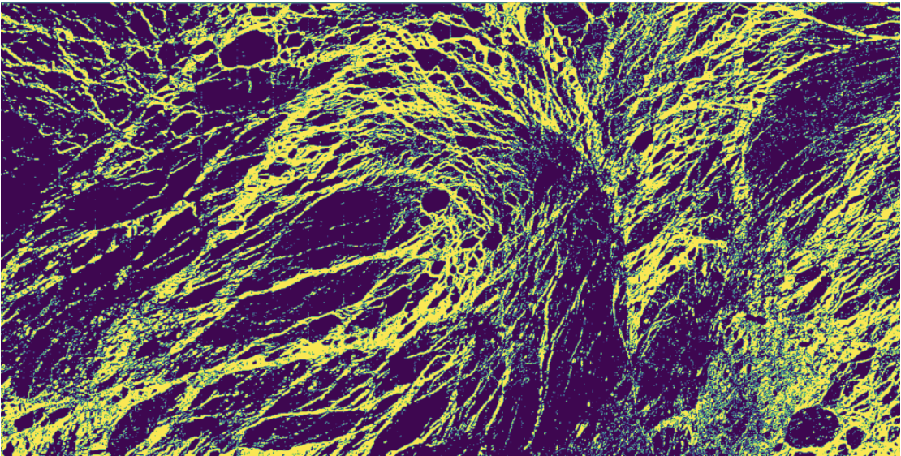

# Assignment-Week-4
<!-- Back to top link -->
<a name="readme-top"></a>
<br />
<div align="center">
  <a href="https://github.com/Gabriel060424/Assignment-Week-4">
    
  </a>
 <h3 align="center">GEOL0069 Week 4: Unsupervised Sea Ice vs. Lead Classification</h3>
<p align="justify">
    This project applies unsupervised learning techniques to distinguish between sea ice and leads (open water channels) using Sentinel-3 altimetry data. The analysis builds upon the foundational notebook Unit_2_Unsupervised_Learning_Methods_updated.ipynb, implementing Gaussian Mixture Models (GMM) to classify radar echoes based on their waveform characteristics. The results are validated against official ESA classifications using a confusion matrix, providing a quantitative assessment of the model's performance in real-world Earth Observation scenarios.
  </p>
<!-- Badges -->
  <p>
    
  </p>
</div>
<!-- TABLE OF CONTENTS -->
<details>
  <summary><strong>Table of Contents</strong></summary>
  <ol>
    <li><a href="#introduction-to-unsupervised-learning">Introduction to Unsupervised Learn
ing</a>
      <ul>
        <li><a href="#k-means-clustering">K-means Clustering</a></li>
        <li><a href="#gaussian-mixture-models-gmm">Gaussian Mixture Models (GMM)</a></li>
      </ul>
    </li>
    <li><a href="#methods--implementation">Methods & Implementation</a>
      <ul>
        <li><a href="#prerequisites--installation">Prerequisites & Installation</a></li>
        <li><a href="#context-sentinel-3-mission">Context: Sentinel-3 Mission</a></li>
      </ul>
    </li>
    <li><a href="#results">Results</a>
      <ul>
        <li><a href="#1-gaussian-mixture-model-demonstration">1. Gaussian Mixture Model Demonstration</a></li>
        <li><a href="#2-mean-and-standard-deviation-analysis">2. Mean and Standard Deviation Analysis</a></li>
        <li><a href="#3-lead-cluster-waveforms">3. Lead Cluster Waveforms</a></li>
        <li><a href="#4-sea-ice-cluster-waveforms">4. Sea Ice Cluster Waveforms</a></li>
        <li><a href="#5-echo-alignment-examples">5. Echo Alignment Examples</a></li>
        <li><a href="#6-validation-confusion-matrix">6. Validation: Confusion Matrix</a></li>
      </ul>
    </li>
    <li><a href="#contact">Contact</a></li>
    <li><a href="#acknowledgments">Acknowledgments</a></li>
  </ol>
</details>
<!-- INTRODUCTION TO UNSUPERVISED LEARNING -->

# Introduction to unsupervised learning

Unsupervised learning methods are essential for discovering hidden patterns in unlabeled data, making them particularly valuable for Earth Observation applications where ground truth data may be limited. This project focuses on two fundamental approaches: K-means clustering and Gaussian Mixture Models.
## K-means Clustering

K-means clustering is a centroid-based algorithm that partitions data into k groups by minimizing the within-cluster variance. The algorithm iteratively assigns data points to the nearest centroid and updates centroid positions until convergence. Key characteristics include:

- **Choosing K**: The number of clusters must be specified in advance
- **Centroid Initialization**: Initial placement affects final results
- **Assignment Step**: Points assigned based on squared Euclidean distance
- **Update Step**: Centroids recomputed as cluster means

**Advantages**: Computational efficiency and ease of interpretation make K-means ideal for exploratory data analysis with large datasets.

## Gaussian Mixture Models (GMM)

GMM is a probabilistic model that assumes data is generated from a mixture of multiple Gaussian distributions with unknown parameters. Unlike K-means, GMM provides soft classification by estimating the probability of each data point belonging to each cluster.

**Key Components**:
- **Number of Components**: Similar to K in K-means
- **Expectation-Maximization (EM) Algorithm**: Iteratively calculates membership probabilities and updates parameters
- **Covariance Type**: Determines cluster shape, size, and orientation

**Advantages**: GMM offers flexibility in cluster shapes and provides uncertainty estimates through probabilistic assignments, making it particularly suitable for capturing the natural variability in sea ice and lead backscatter.

<p align="right">(<a href="#readme-top">back to top</a>)</p>
<!-- METHODS & IMPLEMENTATION -->

# Methods & Implementation

## Prerequisites & Installation

The following software needs to be installed to run the code:

```sh
